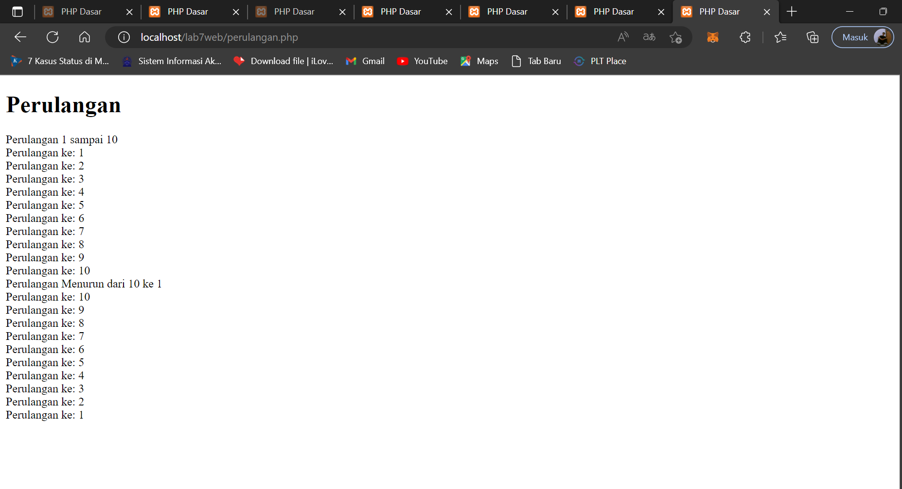

# lab7web
## Belajar Dasar PHP

### Membuat PHP dasar
ini tampialnnya 

### Membuat Variable
ini tampilannya 

### Membuat Form Input
ini tampilannya 

### Membuat Operator
ini tampilannya

### Membuat Kondisi IF
ini tampilannya 

### Membuat Switch
ini tampilannya 

### Membuat Perulangan For
ini tampilannya 

### Membuat While 
ini tampilannya 

### Membuat Forminout
ini tampilannya 

